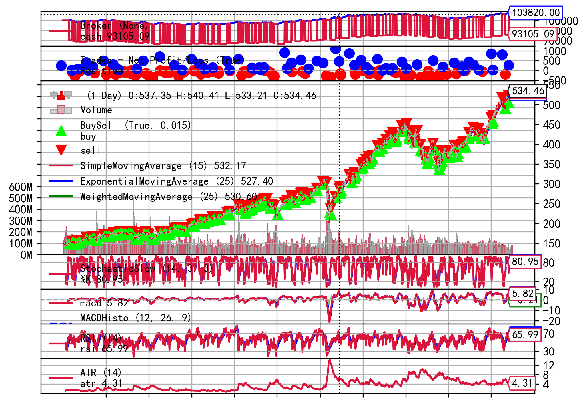

# SMA 简单移动平均线趋势跟踪策略
基于Backtrader框架实现的简单移动平均线（SMA）趋势跟踪策略，支持多标的批量回测，自动生成交易日志和可视化图表。

## 参考资料
- [Backtrader 官方文档](https://www.backtrader.com/)
- [Backtrader 官方文档翻译版（by：菠萝学量化）](https://www.poloxue.com/backtrader/)
- [Backtrader 中文教程笔记（by：量化投资与机器学习）](https://github.com/jrothschild33/learn_backtrader)

---

## 回测结果
### 输出文件说明
- 回测日志文件：存储在 `backtests/logs`
- 可视化结果：存储在 `backtests/figs`

### 回测效果图示例

*图：SMA策略在2014-2024年SPY标的上的回测结果*

### 方案1：每次交易使用10%资金（初始资金 100000.00 元）
| 标的名称   | 最终资金    | 盈亏金额   | 盈亏比例  |
| :--------- | :---------- | :--------- | :-------- |
| SPY        | 103820.00   | 3820.00    | 3.82%     |
| 上证50     | 102295.57   | 2295.57    | 2.30%     |
| 沪深300    | 102236.63   | 2236.63    | 2.24%     |
| 中证500    | 99843.71    | -156.29    | -0.16%    |

### 方案2：每次交易使用50%资金（初始资金 100000.00 元）
| 标的名称   | 最终资金    | 盈亏金额   | 盈亏比例  |
| :--------- | :---------- | :--------- | :-------- |
| SPY        | 119163.88   | 19163.88   | 19.16%    |
| 上证50     | 108822.40   | 8822.40    | 8.82%     |
| 沪深300    | 108327.93   | 8327.93    | 8.33%     |
| 中证500    | 95419.22    | -4580.78   | -4.58%    |

---

## 环境配置
| 名称         | 版本         |
| :----------- | :----------- |
| Python       | 3.13.12      |
| matplotlib   | 3.10.8       |
| numpy        | 2.4.3        |
| pandas       | 3.0.1        |
| backtrader   | 1.9.78.123   |
| yfinance     | 1.2.0        |
